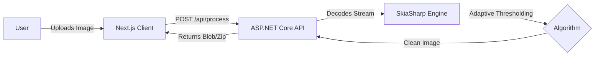

# InkSaver 🖨️

**Stop printing shadows. Start saving ink.**

InkSaver is a **full-stack document processing tool** designed for students and professionals. It uses intelligent image processing algorithms to convert messy, dark, or shadowed photos of documents into clean, printer-friendly black & white PDF/JPGs.

## 🚀 The Problem

Taking photos of notes or whiteboards is common, but printing them is a nightmare.

  * **Wasted Ink:** Grey backgrounds drain printer toner instantly.
  * **Poor Readability:** Shadows make text hard to read on paper.
  * **Dark Mode Screenshots:** Printing a code snippet (dark background) is impossible without inverting colors first.

## 💡 The Solution

InkSaver uses **Adaptive Thresholding** (implemented in high-performance C\#) to "binarize" images. It intelligently separates text from background noise, ensuring you only print what matters.

## ✨ Key Features

  * **⚡ Blazing Fast Binarization:** Uses **Unsafe C\# Pointers** and `SkiaSharp` for pixel-perfect manipulation in milliseconds.
  * **🌑 Dark Mode Support:** Smart inversion logic automatically flips white-text-on-black-background to printer-friendly black-on-white.
  * **🎛️ Real-time Sensitivity Control:** Adjustable threshold slider to perfectly balance noise removal vs. text preservation.
  * **🔐 Privacy First:** No images are stored on the server. They are processed in memory and discarded immediately.
  * **📱 Responsive UI:** Built with **shadcn/ui** for a beautiful experience on mobile and desktop.

## 🛠️ Tech Stack

**Monorepo Structure (Turborepo)**

| Component | Technology | Highlights |
| :--- | :--- | :--- |
| **Frontend** | **Next.js 16** (App Router) | Static Exports, TypeScript, Tailwind CSS |
| **UI Library** | **shadcn/ui** | Radix Primitives, Lucide Icons, Glassmorphism |
| **Backend** | **ASP.NET Core 8 Web API** | Minimal API, High-Performance |
| **Processing** | **SkiaSharp** | Cross-platform 2D graphics, Unsafe Code blocks |

## 🏗️ Architecture



## 🚀 Getting Started

Follow these steps to run InkSaver locally on your machine.

### Prerequisites

  * **Node.js** (v20+)
  * **.NET 10 SDK**

### 1\. Clone the Repository

```bash
git clone https://github.com/Abhi1264/inksaver.git
cd inksaver
```

### 2\. Install Dependencies

```bash
# Install client dependencies
cd apps/web
npm install

# Restore server dependencies
cd ../../apps/api
dotnet restore
```

### 3\. Run the Monorepo

You can run both the client (Port 3000) and server (Port 5000) concurrently from the root directory.

```bash
# From the root folder
npm run dev
```

Open [http://localhost:3000](https://www.google.com/search?q=http://localhost:3000) to see the app.

## 🔌 API Documentation

`POST /api/document/process`

| Parameter | Type | Default | Description |
| :--- | :--- | :--- | :--- |
| `file` | `FormData` | Required | The image file (JPG/PNG) |
| `threshold` | `int` | `120` | Sensitivity (0-255). Lower = Whiter. |
| `invert` | `bool` | `false` | Set `true` to invert colors (for dark mode inputs). |

## 🤝 Contributing

Contributions are welcome\! Please feel free to submit a Pull Request.

1.  Fork the Project
2.  Create your Feature Branch (`git checkout -b feature/AmazingFeature`)
3.  Commit your Changes (`git commit -m 'Add some AmazingFeature'`)
4.  Push to the Branch (`git push origin feature/AmazingFeature`)
5.  Open a Pull Request

## 📄 License

Distributed under the MIT License. See `LICENSE` for more information.

-----

**Built with ❤️ by Abhinav Kumar Choudhary**